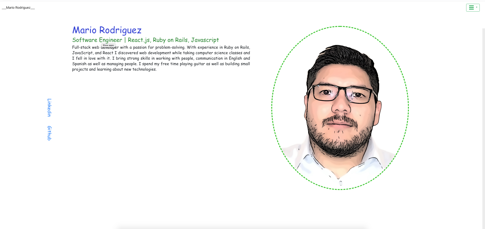
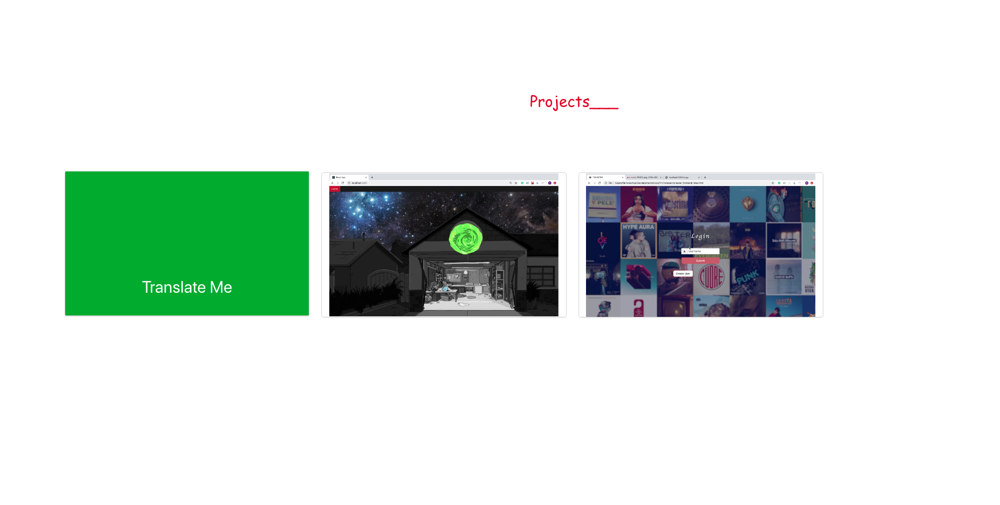
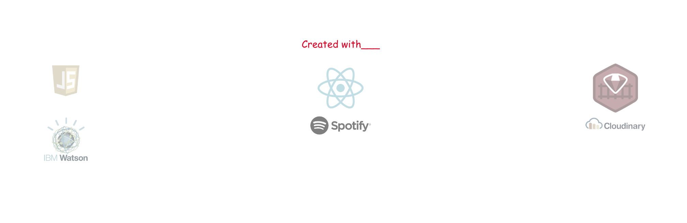
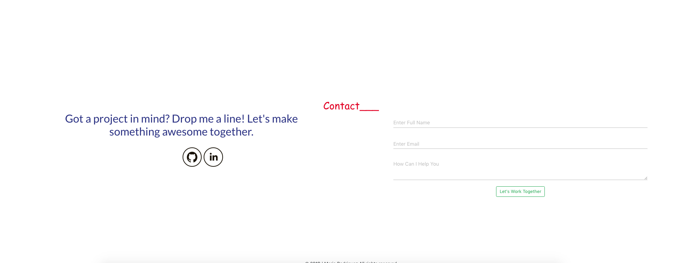

&nbsp; &nbsp; &nbsp; &nbsp; &nbsp; 

## Portfolio website

&nbsp;

## Table of contents
* [General info](#general-info)
* [Technologies](#technologies)
* [images](#images)

## General info

My first portfolio site, it is powered by React, HTML, CSS, and bootstrap UI. The website is host by Heroku. It Holds my basic information as well as some of my projects and a contact component that will email me whenever someone tries to get in touch with me.
	
## Technologies

Project is created with:
* React 
* HTML
* CSS
* BootstrapUI

## Images

##### Main 
 

##### Projects 
 

##### Tech 
 

##### Contact 
 
